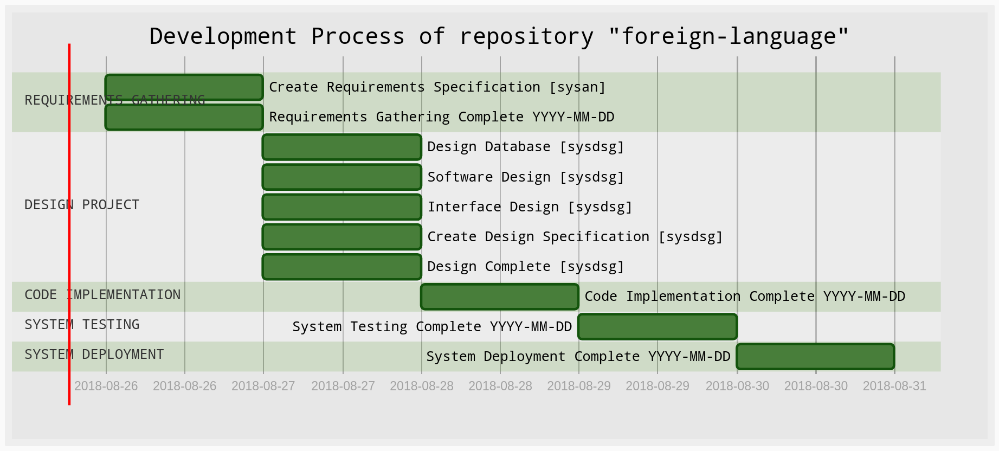

# Development Process

<!-- ## Activities of the development process

- (ps) Planning Sprint
- (rg) Requirements Gathering
- (ra) Requirements Analysis
- (dp) Design Project
- (ci) Code Implementation
- (st) System Testing
- (sd) System Deployment

## Job Functions

- (projm) Project manager
- (sysan) Systems Analyst
- (dsgnr) System designer
- (archt) Software architect
- (progm) Programmer
- (tester) Tester

## Items for configuration manage

- (reqdoc) Requirements document
- (dsgdoc) Design document
- (impdoc) Implementation document
- (tstdoc) Test document
- (depdoc) Deployment document -->

## Identification table of terms

|ID|**Activies of the development process**||ID|**Job Functions**||ID|**Items for configuration manage**|
|:---:|:---:                |:---:|:---:|:---:             |:---:|:---:|:---:|
|plnspr|Planning Sprint         ||prjmn|Project manager        ||reqdoc|Requirements document|
|reqgat|Requirements Gathering  ||sysan|System Analyst         ||dsgdoc|Design document         |
|dsgprj|Design Project          ||dsgnr|System Designer        ||impdoc|Implementation document |
|codimp|Code Implementation     ||archt|Software Architect     ||tstdoc|Test document           |
|systst|System Testing          ||progm|Programer              ||dpydoc|Deployment document     |
|sysdpy|System Deployment       ||teste|Tester                                                  |

## Commit setting

    # Default commits template

        [<Job function ID Key>_<Activity ID Key>_<Commit Counter per job function>] <Description commit>

    # Examples commits

        [prjmn_reqgat_001] This is a commit
        [dsgnr_dsproj_001] This is a another commit

## Tags settings for baseline and releases

    # Default tags template

        Baseline tag
            [tgbl_<Job function ID Key>_<Configuration Item Id Key for management>_<Tag Counter per item of configuration>]

        Release tag
            [tgrl_<Job function ID Key>_<Configuration Item Id Key for management>_<Tag Counter per item of configuration>]

    # Examples tags

        [tg_sysan_rd_001] Baseline of requeriments document defined

___
___

## Life Cycle Model

- Iterative and incremental lifecycle model

### Feature table

|PRODUCT BACKLOG|SPRINT PLANNING MEETING|SPRINT BACKLOG|
|:---:|:---:|:---:|
|||
|||
|||

### Task Table

|Project manager|System Analyst|System Designer|Software Architect|Programer|Tester|
|:---:|:---:|:---:|:---:|:---:|:---:|
|||
|||
|||

