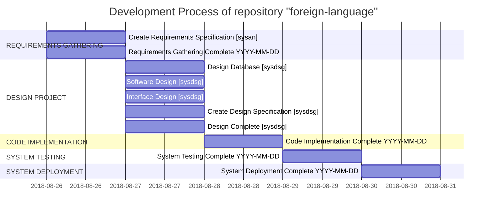

# Gantt Diagram

```mermaid
gantt
dateFormat YYYY-MM-DD
title Development Process of repository "foreign-language"

section REQUIREMENTS GATHERING
Create Requirements Specification [sysan]                   : reqgat1, 2018-08-26, 1d
Requirements Gathering Complete YYYY-MM-DD                  : reqgat1, 2018-08-26, 1d

section DESIGN PROJECT
Design Database [sysdsg]                                    : dsgprj1, after reqgat1, 1d
Software Design [sysdsg]                                    : dsgprj2, after reqgat1, 1d
Interface Design [sysdsg]                                   : dsgprj3, after reqgat1, 1d
Create Design Specification [sysdsg]                        : dsgprj4, after reqgat1, 1d
Design Complete [sysdsg]                                    : dsgprj5, after reqgat1, 1d

section CODE IMPLEMENTATION
Code Implementation Complete YYYY-MM-DD                     : codimp1, after dsgprj5, 1d

section SYSTEM TESTING
System Testing Complete YYYY-MM-DD                          : systst1, after codimp1, 1d

section SYSTEM DEPLOYMENT
System Deployment Complete YYYY-MM-DD                       : sysdpy1, after systst1, 1d
```