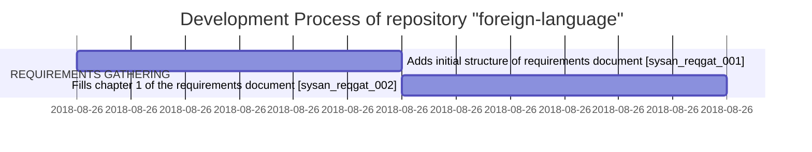

# Gantt Diagram

<!-- section DESIGN PROJECT
Design Database [sysdsg]                                    : dsgprj1, after reqgat1, 1d
Software Design [sysdsg]                                    : dsgprj2, after reqgat1, 1d
Interface Design [sysdsg]                                   : dsgprj3, after reqgat1, 1d
Create Design Specification [sysdsg]                        : dsgprj4, after reqgat1, 1d
Design Complete [sysdsg]                                    : dsgprj5, after reqgat1, 1d

section CODE IMPLEMENTATION
Code Implementation Complete YYYY-MM-DD                     : codimp1, after dsgprj5, 1d

section SYSTEM TESTING
System Testing Complete YYYY-MM-DD                          : systst1, after codimp1, 1d

section SYSTEM DEPLOYMENT
System Deployment Complete YYYY-MM-DD                       : sysdpy1, after systst1, 1d -->